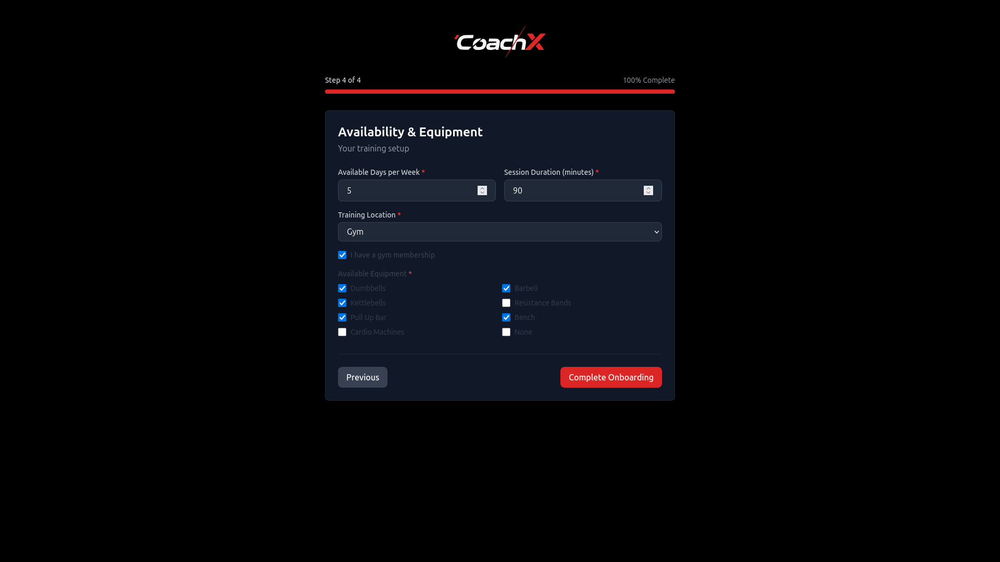

# CoachX 🥊

<div align="center">
  

### Your AI-Powered Personal Training Assistant

Get personalized workout plans powered by AI and sports science research. CoachX combines Google Gemini with Retrieval Augmented Generation (RAG) to deliver expert-level training guidance tailored to your goals, experience, and available equipment.

</div>

---

## 💡 The Problem

I've been training **boxing and CrossFit** for years. I've had my share of bad trainers—people who didn't understand progression, who gave cookie-cutter programs, or who simply weren't invested in my goals.

I turned to ChatGPT and other LLMs for training advice. The AI was actually **better than most trainers** I'd worked with. It understood progressive overload, periodization, and could adapt to my equipment and limitations.

But there was **one massive problem**: **I kept losing my conversations.**

Every time I started a new chat, I had to re-explain everything—my goals, my injuries, my equipment, my training history. It was exhausting and inefficient.

**CoachX solves this.** It's a personal training AI that:

- ✅ **Remembers your profile** (no more re-explaining yourself)
- ✅ **Generates personalized plans** using sport-specific research (RAG)
- ✅ **Maintains conversation context** across sessions
- ✅ **Adapts to your equipment** and limitations

Think of it as ChatGPT for fitness, but it **actually knows who you are**.

---

## 🚀 Quick Start - One Command

**Prerequisites:**

- ✅ **Python 3.8+** (just to run the launcher)
- ✅ **[Docker Desktop](https://docs.docker.com/get-docker/)** (Windows/Mac) or **Docker Engine** (Linux)
- ✅ **[Google Gemini API Key](https://aistudio.google.com/app/apikey)** (free)

**Get started with ONE command:**

```bash
# 1. Clone the repository
git clone https://github.com/cortezxm/prueba-context-engineering
cd prueba-context-engineering

# 2. Run the launcher (it does everything!)
python3 main.py   # Linux/macOS
# or
python main.py    # Windows
```

**That's literally it!** 🎉

The launcher will:

1. ✅ Check that Docker is installed and running
2. ✅ Ask for your Gemini API key (only first time)
3. ✅ Build Docker images (~5 minutes first time, instant after)
4. ✅ Start both backend and frontend services
5. ✅ Show you the URLs and live logs

**When you see this, you're ready:**

```
CoachX is running!

  Frontend: http://localhost:5173
  Backend API: http://localhost:8000
  API Docs: http://localhost:8000/docs

Press Ctrl+C to stop CoachX
```

**To stop:** Just press `Ctrl+C` in the terminal (it cleans up automatically)

**To restart:** Run `python3 main.py` again (instant start, no rebuild)

**To reset data:** `docker compose down && rm -rf backend/coachx.db backend/chroma_db/`

---

## 🎯 How to Use CoachX

### 1️⃣ Complete Onboarding

- Fill in your profile across 4 steps
- Be honest about experience level and limitations
- Select available equipment

### 2️⃣ Generate Your First Plan

- Click "Generate Workout Plan" on dashboard
- Choose duration (1 or 2 weeks)
- Add any custom notes (e.g., "avoid jumping exercises")
- Wait ~10-15 seconds for AI generation

### 3️⃣ Review Your Plan

- Navigate through weeks and days
- Read exercise notes for proper technique
- Note rest days for recovery

### 4️⃣ Ask the AI Coach

- Type questions in the chat
- Ask about technique, nutrition, or modifications
- Chat remembers your conversation context
- Examples:
  - "How do I improve my jab technique?"
  - "What should I eat before training?"
  - "Can you explain progressive overload?"
  - "Who am I?" (get your profile summary)

### 5️⃣ Generate New Plans

- Create new plans as you progress
- Plans adapt to your profile and goals
- Each plan is personalized using RAG

---

## ✨ Features

- 🎯 **Intelligent 4-Step Onboarding**: Guided profile creation with real-time validation
- 🤖 **AI-Powered Plans**: Personalized workouts using Google Gemini Flash 2.5 and RAG
- 💬 **Interactive Chat with Memory**: 24/7 training assistant that remembers your conversation
- 🥊 **Sport-Specific**: Tailored for Boxing, CrossFit, Gym, Calisthenics, and Running
- 🏋️ **Equipment-Aware**: Plans adapt to your available equipment and gym access
- 🔄 **Easy Reset**: Start fresh with a new profile anytime
- 🐳 **Dockerized**: Cross-platform compatibility (Windows, macOS, Linux)

---

## 🏗️ Tech Stack

### Backend

- **FastAPI 0.115.0** - Modern Python web framework
- **SQLite + SQLAlchemy 2.0.35** - Database and ORM
- **Google Gemini Flash 2.5** - Latest LLM with extended context
- **ChromaDB 0.4.22** - Vector database for RAG
- **LangChain 0.3.7** - RAG orchestration
- **Sentence Transformers 3.2.1** - Local embeddings (free, no API calls)

### Frontend

- **Vite 5+ + React 18 + TypeScript** - Fast build tool and modern React
- **Tailwind CSS 3+** - Utility-first CSS framework
- **Axios** - HTTP client
- **React Router** - Client-side routing

### Infrastructure

- **Docker** - Containerization for cross-platform consistency
- **Docker Compose** - Multi-container orchestration

---

## 📸 Screenshots

### Landing Page

Professional landing page with clear call-to-action.


---

### Onboarding Flow

Complete 4-step guided profile creation:

**Step 1: Basic Information**
Name, age, gender, height, and weight with validation.


**Step 2: Experience & Sport**
Training background, primary sport, and years of experience.


**Step 3: Goals & Limitations**
Fitness goals, injuries, and health conditions.


**Step 4: Availability & Equipment**
Training frequency, session duration, and available equipment.



---

### Dashboard & Core Features

**AI Training Coach**
Interactive chat with conversation memory. Ask about technique, nutrition, recovery, or your profile.


**Generate Workout Plan**
Create personalized plans (1-2 weeks) with custom notes and requirements.


**Weekly Plan Overview**
Navigate through training weeks with daily session summaries and rest days clearly marked.


**Daily Workout Details**
Complete exercise breakdowns with sets, reps, rest periods, and technique notes.


---

## 🔄 Resetting User Profile

CoachX is designed as a **single-user** MVP. To test with different user profiles:

### Using Docker

```bash
# Stop containers and remove volumes (clears all data)
docker-compose down -v

# Start fresh
docker-compose up
```

### Using the UI

1. Navigate to the **Dashboard**
2. Click the **"Reset"** button (next to "Generate Workout Plan")
3. Confirm the deletion
4. You'll be redirected to the home page
5. Click "Get Started" to create a new profile

> **Tip**: After reset, clear your browser's localStorage (or use incognito mode) to ensure chat history is fully cleared.

---

## 🛠️ Manual Installation (Alternative)

<details>
<summary>Click to expand manual installation steps</summary>

If you prefer not to use Docker, you can install manually:

### Prerequisites

- ✅ **Python 3.11 or 3.12** ([Download](https://www.python.org/downloads/))
  - ⚠️ **Windows Users**: Python 3.13 requires compilers (use 3.11 or 3.12)
- ✅ **Node.js 18+** and npm ([Download](https://nodejs.org/))
- ✅ **Google Gemini API Key** ([Get it here](https://aistudio.google.com/app/apikey))

### Option 1: One-Command Launcher

```bash
# Clone repository
git clone https://github.com/cortezxm/prueba-context-engineering
cd prueba-context-engineering

# Run launcher
python3 main.py  # Linux/macOS
# or
python main.py   # Windows
```

The launcher will:

1. Check system requirements
2. Create Python virtual environment
3. Install all dependencies
4. Ask for your Gemini API Key
5. Configure environment variables
6. Start both servers

### Option 2: Manual Setup

#### Backend Setup

```bash
cd backend

# Create virtual environment
python3 -m venv venv
source venv/bin/activate  # Windows: venv\Scripts\activate

# Install dependencies
pip install -r requirements.txt

# Configure environment
cp .env.example .env
nano .env  # Add your GEMINI_API_KEY
```

#### Frontend Setup

```bash
cd frontend

# Install dependencies
npm install

# Configure environment (optional)
cp .env.example .env.local
```

#### Start Servers

```bash
# Terminal 1 - Backend
cd backend
source venv/bin/activate
python -m uvicorn app.main:app --reload --port 8000

# Terminal 2 - Frontend
cd frontend
npm run dev
```

Visit **http://localhost:5173** 🎉

</details>

---

## 🔧 Troubleshooting

### Docker Issues

#### Port Already in Use

**Symptoms**: `Error starting userland proxy: listen tcp4 0.0.0.0:8000: bind: address already in use`

**Solution**: Stop the process using the port or change the port in `docker-compose.yml`:

```yaml
ports:
  - "8001:8000" # Change 8000 to 8001
```

#### Containers Won't Start

**Solution**: Check logs and rebuild:

```bash
# View logs
docker-compose logs backend
docker-compose logs frontend

# Rebuild from scratch
docker-compose down -v
docker-compose build --no-cache
docker-compose up
```

#### Permission Denied on Linux

**Solution**: Add your user to docker group:

```bash
sudo usermod -aG docker $USER
# Log out and log back in
```

### Application Issues

#### Chat Doesn't Remember Context

**Solution**: Conversation history is stored in the database. If you reset the profile, history is cleared. This is expected behavior.

#### Plan Generation Is Slow

**Solution**: This is normal. AI generation takes 10-20 seconds depending on plan complexity and API response time.

#### Frontend Shows "Cannot Connect to Backend"

**Solution**:

- **Docker**: Ensure both containers are running (`docker-compose ps`)
- **Manual**: Check backend is running (`curl http://localhost:8000/health`)

#### Error 500 During Onboarding

**Solution**: Check backend logs:

- **Docker**: `docker-compose logs backend`
- **Manual**: Check terminal running uvicorn

Common causes:

- Missing or invalid `GEMINI_API_KEY`
- Database permission issues
- API rate limits exceeded

### Manual Installation Issues

#### Windows: Dependency Compilation Errors

**Symptoms**: Errors about missing Rust compiler, MSVC, or compilation failures.

**Solution**: Use Docker (recommended) or install Python 3.11/3.12 instead of 3.13.

#### "No module named uvicorn"

**Solution**: Virtual environment wasn't activated or installation failed.

```bash
cd backend
rm -rf venv
python3 -m venv venv
source venv/bin/activate  # Windows: venv\Scripts\activate
pip install -r requirements.txt
```

---

## 🔒 Environment Variables

### Backend (`.env`)

```bash
# Required
GEMINI_API_KEY=your_api_key_here

# Optional (defaults work)
DATABASE_URL=sqlite:///./coachx.db
CHROMA_PERSIST_DIRECTORY=./chroma_db
ALLOWED_ORIGINS=http://localhost:5173
```

### Frontend (`.env.local`)

```bash
# Optional (defaults work)
VITE_API_URL=http://localhost:8000
```

> **Note**: When using Docker, set `GEMINI_API_KEY` in the root `.env` file. Docker Compose will inject it into the containers.

---

## 📁 Project Structure

```
prueba-context-engineering/
├── docker-compose.yml           # Docker orchestration
├── .env.example                 # Environment template
├── main.py                      # One-command launcher (manual setup)
├── CLAUDE.md                    # Context Engineering guide
├── README.md                    # This file
│
├── backend/
│   ├── Dockerfile               # Backend container config
│   ├── .dockerignore
│   ├── app/
│   │   ├── main.py              # FastAPI application
│   │   ├── config.py            # Settings management
│   │   ├── api/                 # API endpoints
│   │   ├── ai/                  # AI & RAG system
│   │   ├── crud/                # Database operations
│   │   ├── models/              # SQLAlchemy models
│   │   └── schemas/             # Pydantic schemas
│   ├── knowledge_base/          # RAG documents
│   │   ├── boxing/
│   │   ├── crossfit/
│   │   └── gym/
│   ├── requirements.txt
│   └── .env.example
│
├── frontend/
│   ├── Dockerfile               # Frontend container config
│   ├── .dockerignore
│   ├── src/
│   │   ├── main.tsx             # Entry point
│   │   ├── App.tsx              # Router setup
│   │   ├── pages/               # Route components
│   │   ├── components/          # Reusable components
│   │   ├── lib/
│   │   │   └── api.ts           # API client
│   │   └── types/
│   │       └── index.ts         # TypeScript types
│   ├── package.json
│   ├── vite.config.ts
│   └── .env.example
│
└── docs/
    └── screenshots/             # Application screenshots
```

---

## 📊 API Documentation

Once the backend is running, visit:

- **Interactive API Docs**: http://localhost:8000/docs
- **Alternative Docs**: http://localhost:8000/redoc
- **Health Check**: http://localhost:8000/health

---

## 🎓 Context Engineering

This project demonstrates context engineering techniques:

- 📝 **Comprehensive CLAUDE.md**: Project-specific instructions for AI assistance
- 🎯 **Structured Prompts**: Carefully crafted prompts for workout generation and chat
- 🔍 **RAG Integration**: Sport-specific knowledge retrieval for accurate advice
- 💬 **Conversation Memory**: Context-aware chat that remembers user history
- 🏗️ **Modular Architecture**: Clean separation of concerns for maintainability
- 📋 **PRP Methodology**: Problem Resolution Plans for systematic implementation

See `CLAUDE.md` for the complete context engineering guide.

---

## ⚠️ Important Notes

### Single-User MVP

- Designed for **one user** (no authentication)
- Use **Reset** feature to test different profiles
- All data stored locally (SQLite + ChromaDB)

### Plan Generation Limits

- **Maximum 2 weeks** per plan (optimized for token usage)
- Well-detailed plans with exercise notes
- Generate multiple plans as you progress

### API Rate Limits

- Using **Gemini Flash free tier**
- Generous limits for personal use
- Plans optimized to minimize token usage

### Data Privacy

- All data stored **locally** in Docker volumes or on your machine
- No external database or cloud storage
- Reset clears everything

---

## 🆘 Need Help?

1. **Check Troubleshooting** section above
2. **View logs**:

   ```bash
   # Docker
   docker-compose logs backend
   docker-compose logs frontend

   # Manual
   # Check terminal running uvicorn (backend)
   # Check browser console F12 (frontend)
   ```

3. **Verify environment**:

   ```bash
   # Docker
   docker-compose ps  # Check if containers are running

   # Manual
   python3 --version  # Should be 3.11 or 3.12
   node --version     # Should be 18+
   ```

4. **Review API Docs**: http://localhost:8000/docs

---

## 📝 License

This project is for educational purposes as part of the Context Engineering technical assessment.

---
