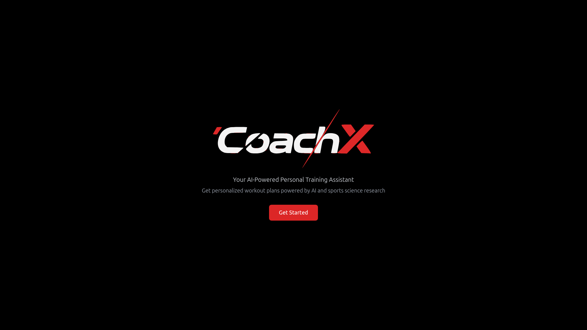
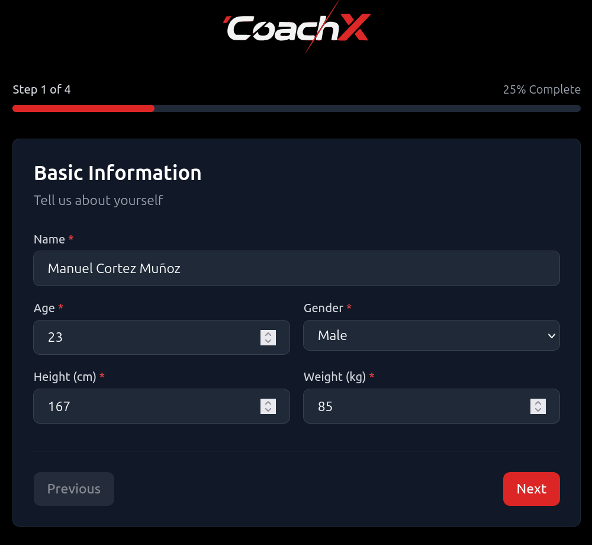
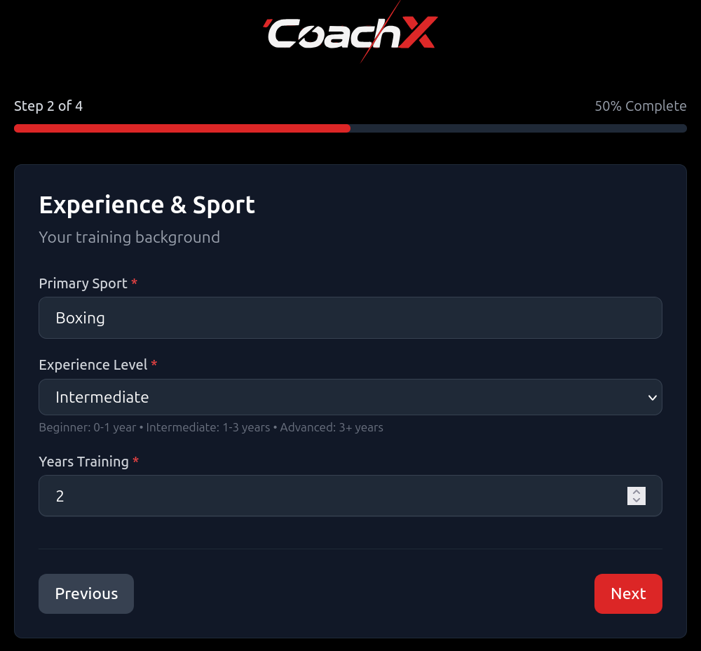
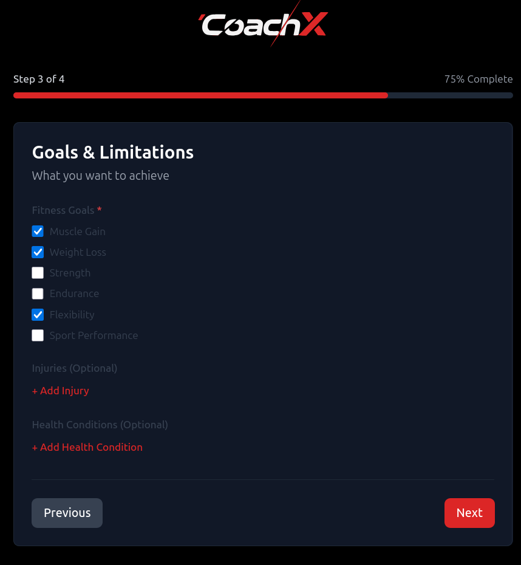
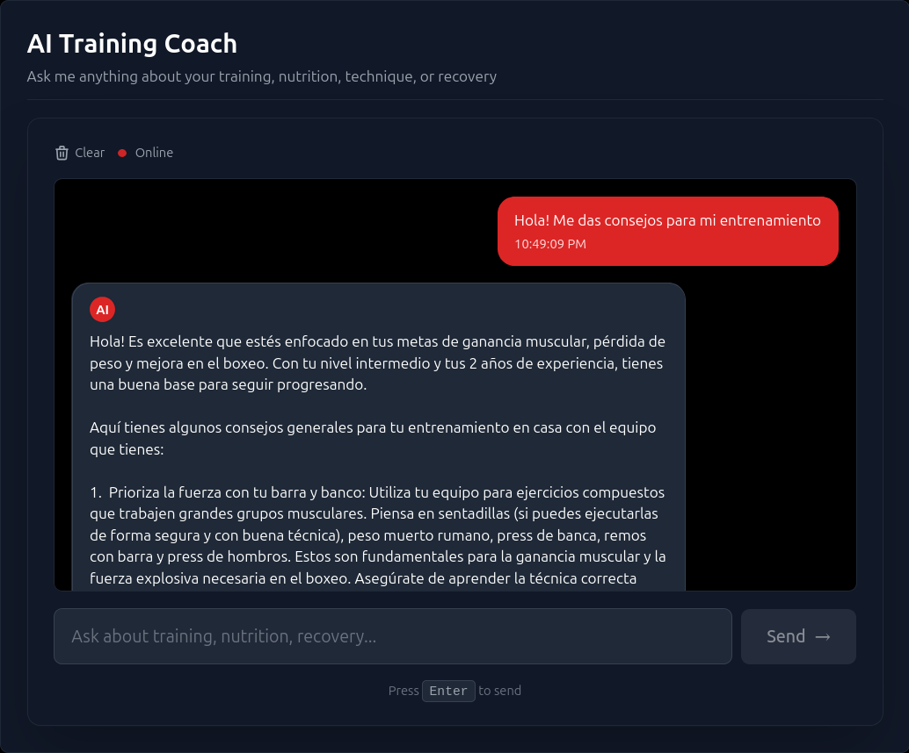
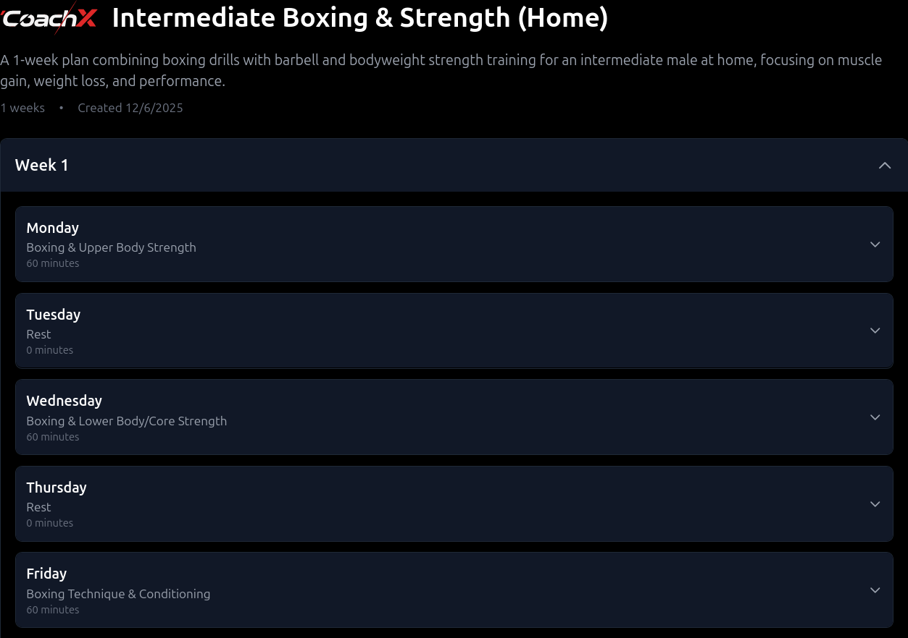
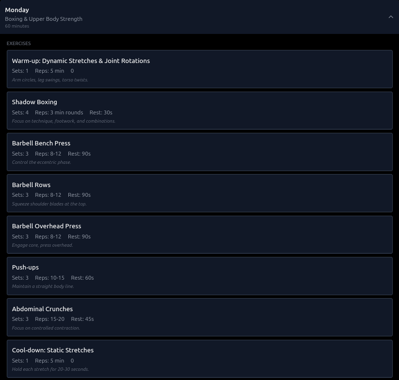

# CoachX 🥊

<div align="center">
  

  ### Your AI-Powered Personal Training Assistant

  Get personalized workout plans powered by AI and sports science research. CoachX combines Google Gemini with Retrieval Augmented Generation (RAG) to deliver expert-level training guidance tailored to your goals, experience, and available equipment.

  
</div>

---

## ✨ Features

- 🎯 **Intelligent 4-Step Onboarding**: Guided profile creation with real-time validation
- 🤖 **AI-Powered Plans**: Personalized workouts using Google Gemini Flash 2.5 and RAG
- 💬 **Interactive Chat with Memory**: 24/7 training assistant that remembers your conversation
- 🥊 **Sport-Specific**: Tailored for Boxing, CrossFit, Gym, Calisthenics, and Running
- 🏋️ **Equipment-Aware**: Plans adapt to your available equipment and gym access
- 🔄 **Easy Reset**: Test multiple user profiles with one-click reset

## 🏗️ Tech Stack

### Backend
- **FastAPI 0.104+** - Modern Python web framework
- **SQLite + SQLAlchemy 2.0+** - Database and ORM
- **Google Gemini Flash 2.5** - Latest LLM with extended context
- **ChromaDB** - Vector database for RAG
- **LangChain 0.1+** - RAG orchestration
- **Sentence Transformers** - Local embeddings (free, no API calls)

### Frontend
- **Vite 5+ + React 18 + TypeScript** - Fast build tool and modern React
- **Tailwind CSS 3+** - Utility-first CSS framework
- **Axios** - HTTP client
- **React Router** - Client-side routing

---

## 🚀 Getting Started

### Prerequisites

Before you begin, ensure you have:

- ✅ **Python 3.11+** ([Download](https://www.python.org/downloads/))
- ✅ **Node.js 18+** and npm ([Download](https://nodejs.org/))
- ✅ **Google Gemini API Key** (Free - see below)

#### Getting Your Gemini API Key (Free)

1. Go to [Google AI Studio](https://aistudio.google.com/app/apikey)
2. Click "Create API Key"
3. Copy the key - you'll need it during setup

> **Note**: Gemini Flash has a generous free tier. This project is optimized to stay within limits (max 2-week plans).

---

### Quick Start (Recommended)

**One command to rule them all:**

```bash
# 1. Clone the repository
git clone https://github.com/cortezxm/prueba-context-engineering
cd prueba-context-engineering

# 2. Run the launcher
python3 main.py
```

**What the launcher does:**

1. ✅ Checks system requirements (Python, Node.js, npm)
2. ✅ Creates Python virtual environment
3. ✅ Installs all backend dependencies
4. ✅ Installs all frontend dependencies
5. ✅ Asks for your Gemini API Key
6. ✅ Configures environment variables
7. ✅ Starts both servers with real-time logs

**When ready, you'll see:**

```
✅ Backend running on http://localhost:8000
✅ Frontend running on http://localhost:5173
✅ CoachX is ready! 🥊

🌐 Open your browser at: http://localhost:5173
```

**First time setup takes ~2-3 minutes** (installing dependencies). Subsequent runs are instant.

---

### Manual Installation (Alternative)

If you prefer to set up manually:

<details>
<summary>Click to expand manual installation steps</summary>

#### Backend Setup

```bash
cd backend

# Create virtual environment
python3 -m venv venv
source venv/bin/activate  # On Windows: venv\Scripts\activate

# Install dependencies
pip install -r requirements.txt

# Configure environment
cp .env.example .env
nano .env  # Edit and add your GEMINI_API_KEY
```

#### Frontend Setup

```bash
cd frontend

# Install dependencies
npm install

# Configure environment (optional - defaults work)
cp .env.example .env.local
```

#### Start Servers

```bash
# Terminal 1 - Backend
cd backend
source venv/bin/activate
python -m uvicorn app.main:app --reload --port 8000

# Terminal 2 - Frontend
cd frontend
npm run dev
```

Visit **http://localhost:5173** 🎉

</details>

---

## 🔄 Resetting User Profile

CoachX is designed as a **single-user MVP**. To test with different user profiles:

### Option 1: UI Button (Easiest)

1. Navigate to the **Dashboard**
2. Click the **"Reset"** button (next to "Generate Workout Plan")
3. Confirm the deletion
4. You'll be redirected to the home page
5. Click "Get Started" to create a new profile

### Option 2: Manual Database Reset

```bash
cd backend
rm -f coachx.db coachx.db-journal coachx.db-wal coachx.db-shm
# Backend will recreate the database automatically on next startup
```

> **Important**: After reset, clear your browser's localStorage (or use incognito mode) to ensure chat history is fully cleared.

---

## 📸 Screenshots

### Landing Page
Professional landing page with clear call-to-action.



---

### Onboarding Flow

Complete 4-step guided profile creation:

**Step 1: Basic Information**
Name, age, gender, height, and weight with validation.



**Step 2: Experience & Sport**
Training background, primary sport, and years of experience.



**Step 3: Goals & Limitations**
Fitness goals, injuries, and health conditions.



**Step 4: Availability & Equipment**
Training frequency, session duration, and available equipment.


---

### Dashboard & Core Features

**AI Training Coach**
Interactive chat with conversation memory. Ask about technique, nutrition, recovery, or your profile.



**Generate Workout Plan**
Create personalized plans (1-2 weeks) with custom notes and requirements.


**Weekly Plan Overview**
Navigate through training weeks with daily session summaries and rest days clearly marked.



**Daily Workout Details**
Complete exercise breakdowns with sets, reps, rest periods, and technique notes.



---

## 🎯 How to Use CoachX

### 1️⃣ Complete Onboarding
- Fill in your profile across 4 steps
- Be honest about experience level and limitations
- Select available equipment

### 2️⃣ Generate Your First Plan
- Click "Generate Workout Plan" on dashboard
- Choose duration (1 or 2 weeks)
- Add any custom notes (e.g., "avoid jumping exercises")
- Wait ~10-15 seconds for AI generation

### 3️⃣ Review Your Plan
- Navigate through weeks and days
- Read exercise notes for proper technique
- Note rest days for recovery

### 4️⃣ Ask the AI Coach
- Type questions in the chat
- Ask about technique, nutrition, or modifications
- Chat remembers your conversation context
- Examples:
  - "How do I improve my jab technique?"
  - "What should I eat before training?"
  - "Can you explain progressive overload?"
  - "Who am I?" (get your profile summary)

### 5️⃣ Generate New Plans
- Create new plans as you progress
- Plans adapt to your profile and goals
- Each plan is personalized using RAG

---

## 🧪 Testing

### Quick Test Flow

```bash
# 1. Start the application
python3 main.py

# 2. Test the complete flow:
# ✅ Complete onboarding with a test profile
# ✅ Generate a 2-week workout plan
# ✅ Ask the chat: "Who am I?"
# ✅ Ask: "How do I do a proper squat?"
# ✅ Navigate through the plan
# ✅ Click Reset button
# ✅ Verify you're back at home page

# 3. Create a different user profile
# ✅ Different sport (e.g., Boxing vs CrossFit)
# ✅ Different experience level
# ✅ Different equipment availability
# ✅ Generate plan and verify it's different
```

### Backend Tests

```bash
cd backend
source venv/bin/activate
pytest --cov=app
```

---

## 🔧 Troubleshooting

### "No module named uvicorn"
**Solution**: The venv wasn't activated or installation failed.
```bash
cd backend
rm -rf venv
python3 -m venv venv
source venv/bin/activate
pip install -r requirements.txt
```

### Frontend shows "Cannot connect to backend"
**Solution**: Backend isn't running or wrong port.
1. Check backend is running on port 8000: `curl http://localhost:8000/health`
2. If not, start it: `cd backend && source venv/bin/activate && python -m uvicorn app.main:app --reload`

### "Error 500" during onboarding
**Solution**: Check backend logs for details. Common causes:
- Missing environment variables
- Database permission issues
- Invalid API key

### Chat doesn't remember context
**Solution**: Conversation history is working. If you reset profile, history is cleared. This is expected behavior.

### Plan generation is slow
**Solution**: This is normal. AI generation takes 10-20 seconds depending on:
- Plan complexity (2 weeks takes longer than 1 week)
- Custom notes (more specific = longer generation)
- API response time

### "Cannot import name 'WorkoutPlan'"
**Solution**: This was fixed. If you still see it, pull latest changes:
```bash
git pull origin main
```

---

## 📁 Project Structure

```
prueba-context-engineering/
├── main.py                      # One-command launcher
├── CLAUDE.md                    # Context Engineering guide
├── README.md                    # This file
│
├── backend/
│   ├── app/
│   │   ├── main.py              # FastAPI application
│   │   ├── config.py            # Settings management
│   │   ├── api/                 # API endpoints
│   │   │   ├── profile.py       # User profile endpoints
│   │   │   └── workout.py       # Workout plan endpoints
│   │   ├── ai/                  # AI & RAG system
│   │   │   ├── gemini.py        # Gemini integration
│   │   │   ├── rag.py           # RAG implementation
│   │   │   ├── prompts.py       # AI prompts
│   │   │   └── workout_generator.py
│   │   ├── crud/                # Database operations
│   │   ├── models/              # SQLAlchemy models
│   │   └── schemas/             # Pydantic schemas
│   ├── knowledge_base/          # RAG documents
│   │   ├── boxing/
│   │   ├── crossfit/
│   │   └── gym/
│   ├── requirements.txt
│   └── .env.example
│
├── frontend/
│   ├── src/
│   │   ├── main.tsx             # Entry point
│   │   ├── App.tsx              # Router setup
│   │   ├── pages/               # Route components
│   │   │   ├── HomePage.tsx
│   │   │   ├── OnboardingPage.tsx
│   │   │   ├── DashboardPage.tsx
│   │   │   └── WorkoutPlanPage.tsx
│   │   ├── components/          # Reusable components
│   │   │   ├── ChatSection.tsx
│   │   │   ├── LoadingSpinner.tsx
│   │   │   └── ErrorMessage.tsx
│   │   ├── lib/
│   │   │   └── api.ts           # API client
│   │   └── types/
│   │       └── index.ts         # TypeScript types
│   ├── package.json
│   ├── vite.config.ts
│   └── .env.example
│
└── docs/
    └── screenshots/             # Application screenshots
```

---

## 🔒 Environment Variables

### Backend (`.env`)

```bash
# Required
GEMINI_API_KEY=your_api_key_here

# Optional (defaults work)
DATABASE_URL=sqlite:///./coachx.db
CHROMA_PERSIST_DIRECTORY=./chroma_db
ALLOWED_ORIGINS=http://localhost:5173
```

### Frontend (`.env.local`)

```bash
# Optional (defaults work)
VITE_API_URL=http://localhost:8000
```

> **Note**: The launcher (`main.py`) creates these files automatically. Manual setup only needed if not using launcher.

---

## 📊 API Documentation

Once the backend is running, visit:

- **Interactive API Docs**: http://localhost:8000/docs
- **Alternative Docs**: http://localhost:8000/redoc
- **Health Check**: http://localhost:8000/health

---

## 🎓 Context Engineering

This project demonstrates advanced context engineering techniques:

- 📝 **Comprehensive CLAUDE.md**: Project-specific instructions for AI assistance
- 🎯 **Structured Prompts**: Carefully crafted prompts for workout generation and chat
- 🔍 **RAG Integration**: Sport-specific knowledge retrieval for accurate advice
- 💬 **Conversation Memory**: Context-aware chat that remembers user history
- 🏗️ **Modular Architecture**: Clean separation of concerns for maintainability

See `CLAUDE.md` for the complete context engineering guide.

---

## ⚠️ Important Notes

### Single-User MVP
- Designed for **one user** (no authentication)
- Use **Reset** feature to test different profiles
- All data stored locally in SQLite

### Plan Generation Limits
- **Maximum 2 weeks** per plan (optimized for token usage)
- Well-detailed plans with exercise notes
- Generate multiple plans as you progress

### API Rate Limits
- Using **Gemini Flash free tier**
- Generous limits for personal use
- Plans optimized to minimize token usage

### Data Privacy
- All data stored **locally** on your machine
- No external database
- Reset clears everything

---

## 🆘 Need Help?

1. **Check Troubleshooting** section above
2. **Review API Docs**: http://localhost:8000/docs
3. **Check logs**:
   - Backend logs appear in the terminal running uvicorn
   - Frontend logs in browser console (F12)
4. **Verify environment**:
   ```bash
   # Check Python version
   python3 --version  # Should be 3.11+

   # Check Node version
   node --version     # Should be 18+

   # Check if servers are running
   curl http://localhost:8000/health
   curl http://localhost:5173
   ```

---

## 📝 License

This project is for educational purposes as part of the Context Engineering technical assessment.

---

<div align="center">

  **Made with ❤️ and 🤖 AI**

  Powered by Google Gemini Flash 2.5 & RAG

</div>
